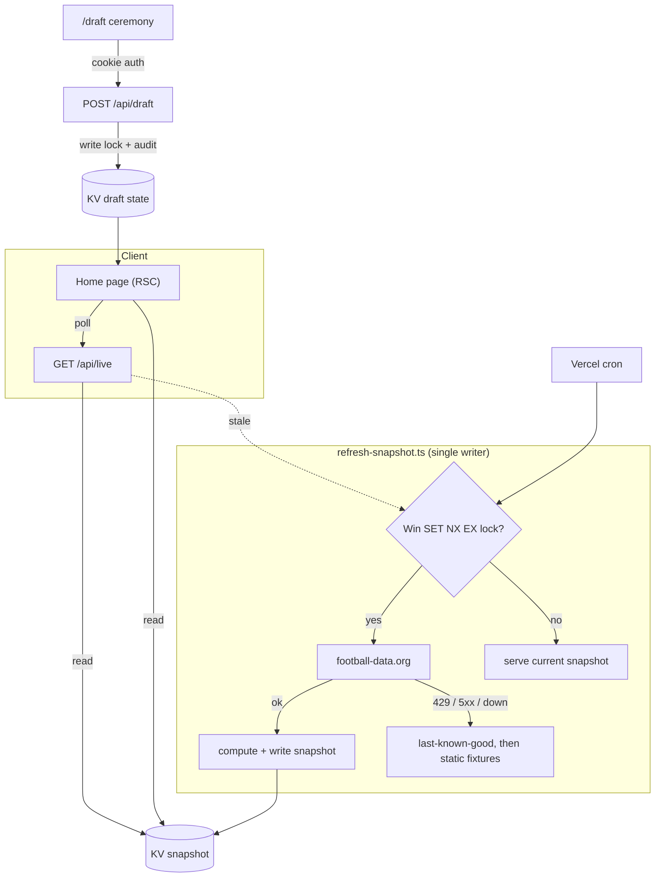

# World Cup Sweepstake 2026 ⚽

A live tracker for a 2026 World Cup sweepstake between 12 friends. Editorial
broadcast styling, live scores, an animated draft ceremony, and a leaderboard
that updates as matches play out.

## How the Sweepstake Works

- **12 participants**, each assigned **4 national teams** (via the draft ceremony)
- Points accumulate from every game your teams play:
  - **Win** = 3 points
  - **Draw** = 1 point
  - **Loss** = 0 points
- Combined points across all 4 teams determine your leaderboard position

## Features

- **Leaderboard**: live standings with a podium and full table, plus a "Ledger
  of Fate" view and live overtake highlighting
- **Fixtures**: group-stage schedule and a projected knockout bracket with
  scores, venues, and team owners
- **Groups**: group tables (A to L) with filtering
- **Teams**: each participant's 4 teams with individual breakdowns
- **Draft ceremony**: an animated reel-spin draft at `/draft`
- **Dev console**: env-gated tooling to override scores and simulate outcomes
- Per-tab colour worlds, shareable broadcast cards, fully responsive
- **Live scores** from football-data.org, served through one canonical snapshot

## Tech Stack

- **Next.js 16** (App Router, RSC) + **React 19** + **TypeScript** (strict)
- **Tailwind CSS 4**, GSAP + Lenis
- **Vercel KV** (Upstash) for draft + snapshot state
- **football-data.org** API (paid tier, 20 req/min)
- Deployed on **Vercel**

## Getting Started

```bash
# 1. Install dependencies
npm install

# 2. Configure env (the app runs with none of it, on static data)
cp .env.local.example .env.local
# Add a football-data.org key, KV credentials, and secrets as needed

# 3. Run the dev server
npm run dev
```

Open [http://localhost:3000](http://localhost:3000).

## Architecture

Reads never touch the upstream API directly. One canonical snapshot in KV is the
single source of truth; a lock-guarded refresh is the only thing that calls
football-data.org, which keeps every viewer on identical data and the request
count far under the 20 req/min budget.



Details and the reasoning behind each piece:

- [docs/adr/](docs/adr/): architecture decision records
- [docs/CACHING.md](docs/CACHING.md): the request budget and invalidation plan
- [docs/api.md](docs/api.md): the API surface and contracts
- [docs/football-data-runbook.md](docs/football-data-runbook.md): match-day runbook + DR
- [docs/PRODUCTION_READINESS_AUDIT.md](docs/PRODUCTION_READINESS_AUDIT.md): the security/reliability audit and roadmap

## Environment Variables

| Variable                      | Required               | Description                                                                  |
| ----------------------------- | ---------------------- | ---------------------------------------------------------------------------- |
| `FOOTBALL_DATA_API_KEY`       | No                     | football-data.org key. Without it, the app uses static fixtures.             |
| `KV_REST_API_URL`             | Prod (writes)          | Vercel KV REST URL. Provisioned when you attach a KV store. Optional in dev. |
| `KV_REST_API_TOKEN`           | Prod (writes)          | KV read/write token.                                                         |
| `KV_REST_API_READ_ONLY_TOKEN` | No                     | Read-only KV token used for hot read paths (least privilege).                |
| `DRAFT_SECRET`                | Prod (to use `/draft`) | Password for the draft. Unset in production = draft locked (fails closed).   |
| `CRON_SECRET`                 | Prod                   | Bearer secret the Vercel cron sends to `/api/cron/refresh`.                  |
| `ENABLE_DEV_CONSOLE`          | No                     | `true` to expose `/dev-console` outside local dev.                           |
| `DEV_CONSOLE_PASSWORD`        | No                     | Password for `/dev-console` (required if enabled in production).             |

On Vercel: Settings → Environment Variables.

## Dev Console

`/dev-console` overrides fixture scores and simulates outcomes against the same
scoring engine as the main app. Overrides are local-only (browser localStorage)
by design and never touch the canonical snapshot.

- Enabled automatically in local development.
- In production/preview, set `ENABLE_DEV_CONSOLE=true` (and `DEV_CONSOLE_PASSWORD`
  to lock it).

## Operational scripts

```bash
npm run draft:status     # summarise the persisted draft on a deployment
                         #   set DRAFT_API_BASE_URL and DRAFT_SECRET for a remote check
npm run draft:backup     # list / save / restore the locked-draft backup
npm run snapshot:bust    # delete the snapshot so the next read recomputes
npm run load-test        # hammer /api/live and watch the upstream stay coalesced
```

`draft:status` calls the (now cookie-authed) `GET /api/draft`; set `DRAFT_SECRET`
to the deployment's secret so the script can authenticate.

## Updating Participants and Scores

- Participants: edit `src/data/participants.ts`.
- Static fallback scores (when not using the API): edit `src/data/fixtures.ts`,
  commit, and push; Vercel redeploys and everything recalculates.

## Quality gates

```bash
npm run validate         # type-check + lint + format:check
npm run test             # unit tests (vitest)
npm run test:coverage    # unit tests with the coverage gate
npm run test:e2e         # Playwright smoke + axe accessibility
npm run build            # production build
```

CI runs all of the above plus a dependency audit and a bundle-size gate.

## Deployment

Connect the GitHub repo to Vercel for automatic deployments on push, or:

```bash
npm run build
npx vercel
```
